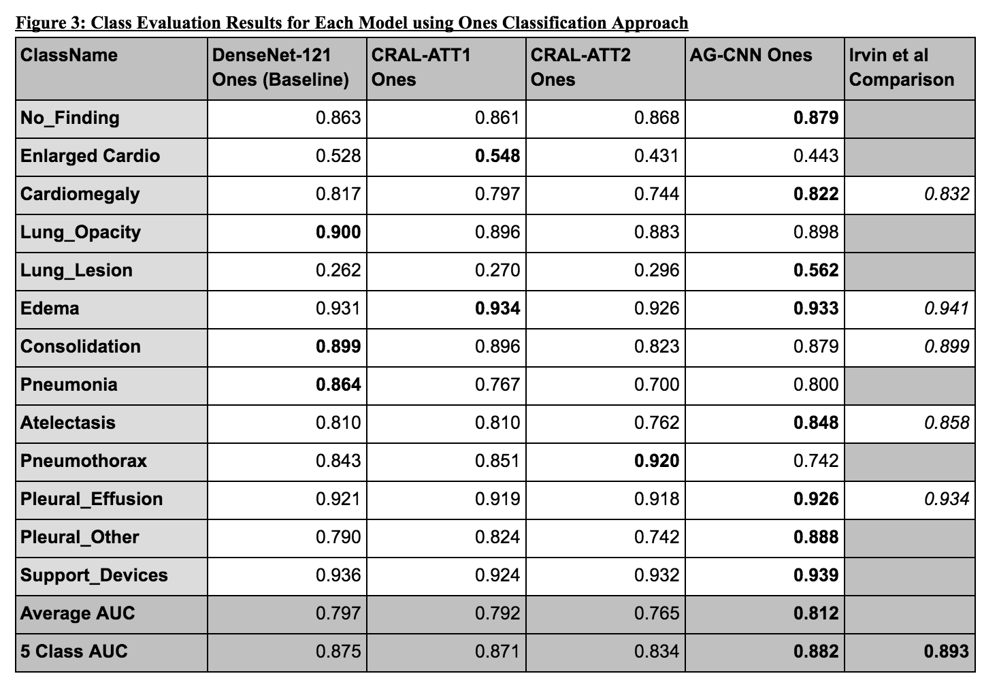

# Detecting X Ray Diseases Using CheXpert Chest X Ray Images with Deep Learning

This repo contains the code for the deep learning models used to predict X Ray disease using CheXpert data. 4 models were built for this project.

1) DenseNet-121
2) Attention Guided Convolutional Neural Network (AG-CNN)
3) Category Wise Residual Learning (CRAL)
a) using attention scheme 1
b) using attention scheme 2

## BEST MODEL RUN (AG_CNN)
The models are all in `model_output` folder. To run the best model please download this folder and please first install the provided environment using:

`conda env create -f environment.yml`

You can activate  environment after using:

`source activate bd4h_project`

Then run the folllowing command from the bd4h_project folder:

`python evaluation.py 'AGCNN_ONES'`

This command runs the best model which is the AGCNN using the 'Ones Classification' approach mentioned by Irvin et al and it prints out the model performance on validation set in terms of its AUC, Accuracy and Loss. It also saves a copy of the results in the modell_output folder under the csv filename: `auc_all_classes_AGCNN_ONES.csv`

## OTHER MODEL RUNS
Additionally you can also run a few more models for evaluation on validation set using the following commands. 

`python evaluation.py 'DENSE_ONES'`  
This runs the DenseNet-121 model using Imagenet pretrained weights using the 'Ones Classification' approach

`python evaluation.py 'DENSE_MULTI'`   
This runs the DenseNet-121 model using Imagenet pretrained weights but using the '3 Class Classification' approach

`python evaluation.py 'CRAL_ATT1_ONES'`  
This runs the CRAL model with Att1 attention module and using the 'Ones Classification' approach. Att1 architecture has been described in the paper

`python evaluation.py 'CRAL_ATT2_ONES'`  
This runs the CRAL model with Att2 attention module and using the 'Ones Classification' approach. Att2 architecture has been described in the paper.

After running these models you should be able to replicate the results in Figure 3 of paper shown below. Please do not try to run the other Multiclassification models as models for those have been left out from submission. You will get an error if you try to run any other model other than the 5 listed above.

## Evaluation Notebook
Model predictions from previous iteration have been saved in the `model_output/preds` folder. You can run the `X_Ray_Models_Analysis.ipynb` notebook to see the results of each model and the ROC and Confusion matrices. 

Note that these predictions are from a previous model run so results are slightly different than the current validation results.

## Results Paper
The results are all in the paper in the `/presentation` folder. The folder also contains the presentation.

## TRAINING SCRIPTS
Training scripts are as follows. They have been initialized to run as Ones Classification. Note they will not run without first downloading training data from Chexpert. Some of these scripts can take 1 day to run.

1) `train_dense.py` -- trains the DenseNet model using the Ones Classification approach
2) `train_cral.py` -- trains the CRAL model using the Ones Classification approach and attention 1 scheme
3) `train_agcnn.py` -- trains the AG-CNN model using the Ones Classification approach
4) `train_agcnn_cral.py` -- trains the AG-CNN model using the 3 Class Classification approach

## MODELS FILES
`mymodels.py` This file has all the Ones Classification models except CRAL ATT 2 Ones. The other models are in the following files and can be inspected to see the modeling structure.
`mycral_att1_multi.py` This file has the CRAL ATT 1 3 Class Classification Model
`mycral_att2_multi.py` This file has the CRAL ATT 2 3 Class Classification Model
`mycral_att2_ones.py` This file has the CRAL ATT 2 Ones Classification Model
